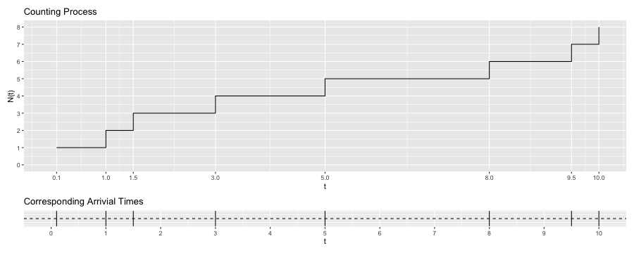
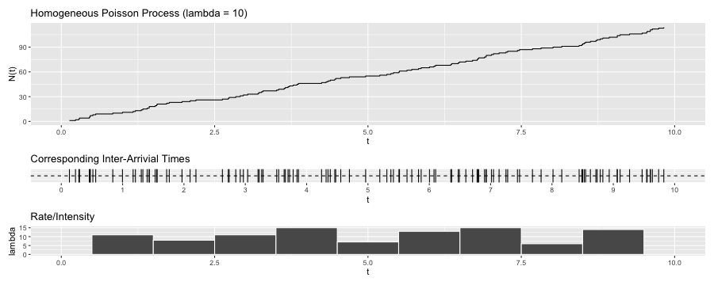
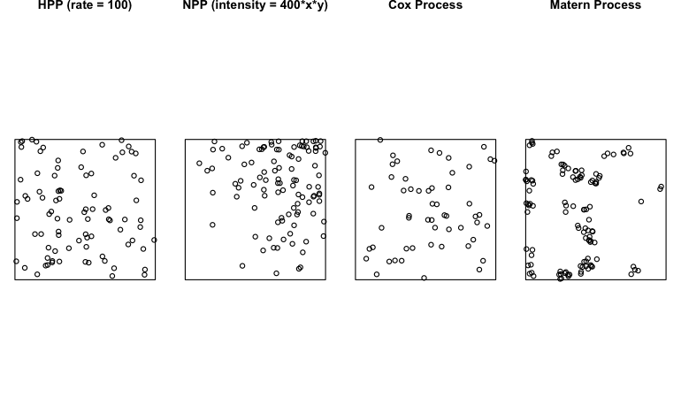
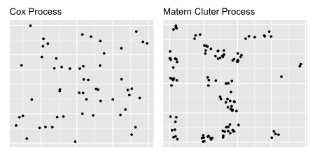

```{r setup, include=FALSE}
knitr::opts_chunk$set(echo = FALSE)
```

```{r warning=FALSE, message=FALSE}
library(spatstat)
library(tidyverse)
library(here)
```

## Background: Hawkes Processes 

Events such as earthquake epicenters, crime patterns, forest wildfires, financial transcations, etc. often exhibit triggering and/or clustering behavior. 

Being able to capture events with such behavior, Hawkes processes, also known as self-exciting point processes (SEPP), have the potential to be a powerful predictive tool.

## Background: Characteristics

The defining characteristic of SEPP is that it *self-excites*. Given the history of events, more recent events also exert more influence on the rate at which events occur. 

For example, 

- an earthquake that causes aftershocks, 

- a gang rivalry that triggers retaliations following the gang crime. 

In both cases, the initial event can continue to spawn *offspring* events and the *offspring* events can spawn *offspring* events of their own, but the spawns fade out eventually.

## Background: Applications

SEPP find applications in a wide variety of fields since they have been used to model events such as

- earthquake epicenters (Ogata, 1988, 1998),

- crime patterns (Mohler et al., 2011; Reinhart & Greenhouse, 2018), 

- forest wildfires (Peng, et al., 2005), 

- insurance claims (Stabile et al., 2010), 

- financial transcations (Bauwens and Hautsch, 2009; Embrechts et al., 2011; Bacry et al., 2015), 

- social network events (Zhao et al., 2015; Rizoiu et al., 2017), 

- neuron activities (Johnson, 1996; Gerhard et al., 2017), and 

- disease spread or transmission (Meyer et al., 2012; Meyer & Held, 2014).

## Background and Objectives

SEPP have not gained much attention from the machine learning communities even with their predictive capabilities. 

Some relevant point processes are often left out from graduate-level, introductory spatial statistics and stochastic processes courses.

**Project Goal:** Give an overview of various types of point processes so that interested readers have the background knowledge to comprehend existing SEPP literature as well as explore the field further.

## Outline

Give introductions, discuss properties and applications of

1. Counting Process

2. HPP (Homogeneous Poisson Process)

3. NPP (Nonhomogeneous Poisson Process)

4. **Cox and Cluster Processes**

5. **Hawkes Process**

6. **Spatio-Temporal Self-Exciting Point Process**

Wrap up with Recent Advancements and Future Work of SEPP & (if time permits) Thinning Algorithm 

## Counting Process

A counting process counts the occurrence (or number) of events over time, space, space-time, etc. 

For example, 

- the arrival time of customers at a super market, 

- the location of trees occuring at a point in space,

- earthquake's epicenter as a point in space and time, 

so long as they are countable. 

## Counting Process



Let $N(t)$ counts the number of events up to some time $t$, 

1. $N(t)$ > 0, 

2. $N(t)$ is an integer, 

3. $N(t)$ is an increasing function,

4. $N(2) = 3$, $N(4) = 4$, etc.

## HPP (Homogeneous Poisson Process)

HPP is one of the simplest yet most-widely used point processes (Baddeley et al., 2015). 

For example, 

- bus arrivals at a bus stop, 

- car accidents at a site,

- the document requests on a web server over time, etc.

HPPs are independent, stationary, and homogeneous. The distribution of the numbers of events, $N(t)$, depends only on the length of the interval $h$ (e.g. $(t, t+h]$).

The defining characteristic of HPP is that $N(t)$ follow a Poisson distribution with a constant rate $\lambda$ (e.g. events over time).

## HPP ($\lambda = 10$)



1. Cumulative number of points grows at a constant linear rate.

2. Histogram of rate appears roughly uniform. 

3. $N(3) \approx 30$, $N(4) \approx 40$, etc.

## NPP (Nonhomogeneous Poisson Process)

Assuming that the rate in which points occur is constant is often not realistic in practice. 

For example, 

- the arrival rate of customers is higher during lunch time as compared to say, 2am,

- environmental factors such as temperature and rainfall affect the spatial distribution of the trees.

NPPs are independent but not stationary nor homogeneous. The distribution of $N(t)$ can change when shifted in the location of the interval $t$.

For NPP, $N(t)$ still follow a Poisson distribution but with an intensity function $\lambda(t)$ such that the rate/intensity now varies with a function of time.

## A Motivating Example: HPP vs. NPP in 2D

{height=70%, width=70%}

HPP points appear to be uniformly distributed in area $|u|$.

NPP points concentrate at the upper-right corner.

## Cox and Cluster Processes

Relaxing the independence assumption to allow for dependence between events make the models even more flexible

1. Cox Processes 

2. Cluster Processes

\ 

Cox processes (or doubly stochastic Poisson processes) can be viewed as a Poisson process with a random intensity function $\Lambda$.

The intensity function $\Lambda$ is random since it relies on an underlying set of random variables, called a random field (Baddeley et al., 2015).

## Cox Processes

Examples better modeled as Cox processes include

- locations of emergent bramble cane (blackberry) plants and

- *Beilschmiedia* trees (Baddeley et al., 2015), etc.  

In these examples, there appears to be some spatial covariate (e.g. light, humidity, soil quality) or external factor that makes it more likely to observe the plants or trees in some areas.

When the intensity is relatively high in some area of space, points occur more frequently. When the intensity is low, fewer points occur. 

## Cox Processes

A Cox process can be thought as a hierarchical model with two levels. That is,  

1. there is some set of random variables that influences the intensity function and

2. based on this intensity function, we observe the set of points. 

Within the general class of Cox processes, we will show a realization of a mixed Poisson process, the simplest example of all, as a demonstration. 


## Cluster Processes 

There is a significant overlap between Cox processes and cluster processes. While Cox processes can sometimes appear to exhibit clustering of points, cluster processes tend to make the clustering of points more explicit.

Examples that can be modeled as cluster processes include 

- seedlings and saplings of California redwood (Baddeley et al., 2015), etc.

In this example, unobserved *parent* trees give rise to clusters of observed *offspring* trees but only *offspring* trees are observed.

## Cluster Processes 

A cluster process can be thought as a hierarchical model with three levels. That is,

1. there is some random or non-random intensity function, 

2. based on this intensity function, some set of *parent* (or *center*) points are laid down which we often don't observe, but

3. given the location of the *parent* points, some set of *offspring* points are generated around the *parent* points which we observe.

Within the general class of cluster processes, we will show a realization of a Matern cluster process as a demonstration.

## Cox vs. Matern Cluster Processes in 2D

{height=70%, width=70%}

Mixed Poisson process (intensity = exp(n = 1, rate = 1/100)) 

- involves generating a random variable $\Lambda$ and, given the value of $\Lambda$, generating a Poisson process with intensity function $\Lambda$, 

- "clusters" accordingly to some specified distribution (i.e. an exponential r.v.).

## Cox vs. Matern Cluster Processes in 2D

{height=70%, width=70%}

Matern cluster process (kappa = 20, r = 0.05, mu = 5) 

- involves generating homogeneous Poisson parents and each *parent* gives rise to Poisson number of *offspring* uniformly distributed in a disc of radius $r$ centered around the *parent*, 

- clusters in some defined area (i.e. a disc).

## Hawkes Process: Examples

Hawkes processes also allow for dependence between events. The distinguishing feature of the Hawkes processes is that they depend on past events, which is also what makes Hawkes processes *self-excite*. 

For example, 

- a mainshock earthquake is often followed by aftershocks, 

- one act of violence often features an act of retaliatory violence, 

- one patient may infect others.

In these examples, the occurrence of an event increases the occurrence of future events nearby in space and/or time (i.e. *self-exciting*). 

## Hawkes Process

Since the intensity of the process is now as a function of past history, we refer to the expected rate as a *conditional intensity function*, $\lambda(t | \mathcal{H}_{t}^{})$.

Characteristics of Hawkes processes are such that

- When points have occurred in nearby time and/or space, the intensity at which points occur are expected to be higher and then it gradually declines as the events get further away.

- More recent events exert more influence on the intensity but the intensity will decay until the next event.

## Conditional Intensity Function

**Definition 2.5.2** (Hawkes Process) A counting process associated with past events is said to be a Hawkes process with a conditional intensity function, which takes the form
$$
\lambda(t | \mathcal{H}_{t}^{}) = \lambda_0(t) + \sum^{}_{i: T_i < t} \phi( t - T_i) , 
$$
where 

- $\lambda_0(t)$ (sometimes denoted as $\mu$) is the the constant background rate,

- $\sum(\cdot)$ is what makes Hawkess process *self-excites*, 

- $T_i < t$ are the events time occur before current time $t$, 

- $\phi(\cdot)$ is the kernel function (or $g(\cdot)$ the triggering function) through which the intensity depends on past events, and

- $\mathcal{H}_{t}^{}$ is the past history up to time $t$.

## Triggering Function

Typical choices of $\phi(\cdot)$ include exponentially decaying function and power-law kernel (Rizoiu, 2017), which take the forms of
$$
\phi(x) = \alpha e^ {-\beta x}
$$
and
$$
\phi(x) = \frac{\alpha} { (x + \beta) ^ {\eta + 1}}.
$$

Exponentially decaying function has been applied to financial data (Embrechts et al., 2011).

Power-law kernel, which decays faster initially but ends with a flatter tail, has been used in seismology (Ozaki, 1979) and social media (Rizoiu et al., 2017).

## Simulations of a Hawkes Process


Hawkes process with the exponentially decaying function ($\mu = 0.5, \alpha = 0.5, \beta = 0.7$)

- Each time the event arrives, the intensity increases and then it declines back to the background rate. 

- The intensity for this realization gradually increases over time too.

## Spatio-temporal SEPP (Self-Exciting Point Process)

As an extension of temporal Hawkes processes, the conditional intensity function for the spatio-temporal SEPP takes the form of
$$
\lambda(t | \mathcal{H}_{t}) = \mu(s) + \sum^{}_{i: T_i < t} g(s - s_i, t - t_i), 
$$
where ${s_i, i = 1,2,...}$ are the sequence of locations of events and ${t_i, i = 1,2,...}$ are the times of events.

Note that, 

1. $g(\cdot)$ is often defined to be separable in space and time.

2. $\mu(s)$ here can be taken to be a function of space, which is often a NPP or constant.

3. Events closer to some given spatial and temporal location are more heavily influenced by the points that occur nearby in *both* space and time.

## Recent Advancements and Future Work of SEPP

Recent work has extended the use of SEPP to novel applications such as 

- mass shootings (Boyd & Molyneux, 2021), 

- COVID-19 transmission (Chiang et al., 2020), and 

- gang violence (Park et al., 2021). 

However, there is still much work to be done which include computational advances to ease the burden of applying the models to bigger data sets (Holbrook et al., 2021), residual and model diagnostics, methods that make the models more flexible and applicable, etc.

## Thinning Algorithm

Thinning algorithm is also called acceptance-rejection method. Broadly put, the thinning algorithm involves randomly deleting points from a point pattern. 

The process requires 

1. first simulating a HPP, 

2. creating a $\lambda(t)$ function and applying it to the HPP, and 

3. using $min( {\lambda^*} / {\lambda}, 1)$ as the accepting probability to randomly keep or delete/*thin* the points.

## Algorithm 2: Simulations of a Hawkes Process via Thinning Algorithm

\ \ Imput $\mu$, $\alpha$, $\beta$, $\lambda$, $t_{max}$

1. Simulate a HPP using Algorithm 1 (Appendix)

2. Create a $\lambda(t)$ function where the function $= \mu + \sum^{}_{i: T_i < t} \alpha e^ {-\beta x}$

3. Set $\lambda^*$ = apply the $\lambda(t)$ function to the HPP

4. Generate $u \sim U(0,1)$

5. **if** ($u < min( \frac{\lambda^*} {\lambda}, 1)$) where the accepting probability $= min( {\lambda^*} / {\lambda}, 1)$

6. \ | Keep the points

7. **else**

8. \ | "Thin" or reject the points and **return** $\{t_{k}\}_{k = 0, 1,... }$

## Thank you!

Prequel to Hawkes Processes: An Overview of Spatial, Temporal and Spatio-Temporal Point Processes and Some Simulations

Frances Lin

MS student, Dept. of Statistics, Oregon State University

Full report, code, etc. are available at 

GitHub: franceslinyc, [Hawkes-Process-2021](https://github.com/franceslinyc/Hawkes-Process-2021)

## Acknowledgments

I want to thank 

- James Molyneux for his constant support and encouragement while advising this Master's project, 

- Lisa Madsen & Charlotte Wickham for their willingness to co-advise as I press on for the PhD program here at OSU, 

- Sarah Emerson for both academic and nonacademic support that played major roles in my decision to pursue the PhD here, 

- my cohort, our previous cohort and other PhD students for reassuring us that we will make it too despite the ongoing challenges, 

- my family and friends for keeping me sane while being remote, and my 92-year-old grandma for hanging in there while battling brain tumors since last year.

But no thanks for the COVID-19 pandemic, 2020 Oregon wildfires and the social unrest that sparked the Black Lives Matter & Stop Asian Hate movement.


