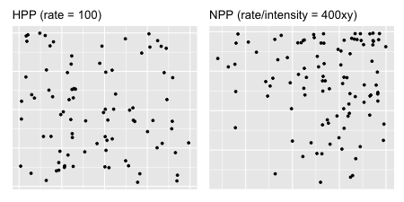

```{r setup, include=FALSE}
knitr::opts_chunk$set(echo = FALSE)
```

```{r warning=FALSE, message=FALSE}
library(spatstat)
library(tidyverse)
library(here)
```

## Background: Hawkes Process 

Events such as earthquake epicenters, crime patterns, forest wildfires, financial transcations, etc. often exhibit triggering and clustering behavior. 

Hawkes process, also known as self-exciting point process (SEPP), can be used to capture events with such behavior. The original Hawkes processes are temporal, whereas the more recently developed SEPP have been extended to account for both the spatial and temporal aspects of the data.

## Background: Characteristics

The defining characteristic of SEPP is that it 'self-excites', i.e., the occurrence of an event increases the occurrence of future events nearby in space and/or time, although the events don't self-excite in perpetuity. Given the history of events, more recent events also exert more influence on the rate at which events occur. 

In seismology, an event can be an earthquake that causes aftershocks. In criminology, an event can be a gang rivalry that triggers retaliations following the gang crime. In both cases, the initial event can continue to spawn 'offspring' events and the 'offspring' events can spawn 'offspring' events of their own, but the spawns fade out eventually.

## Background: Applications

SEPP have the potential to become a powerful predictive tool for a wide variety of applications and have been used to model events such as

- earthquake epicenters (Ogata, 1988, 1998)

- crime patterns (Mohler et al., 2011; Reinhart & Greenhouse, 2018), 

- forest wildfires (Peng, et al., 2005), 

- insurance claims (Stabile et al., 2010), 

- financial transcations (Bauwens and Hautsch, 2009; Embrechts et al., 2011; Bacry et al., 2015), 

- social network events (Zhao et al., 2015; Rizoiu et al., 2017), 

- neuron activities (Johnson, 1996; Gerhard et al., 2017), and 

- disease spread or transmission (Meyer et al., 2012; Meyer & Held, 2014).

## Background and Objectives

SEPP have not gained enough attention from the machine learning communities even with their predictive capabilities. Some relevant point processes (e.g. nonhomogeneous Poisson, Cox and cluster processes) are often left out from graduate-level, introductory spatial statistics and stochastic processes courses.

The objective of this project is then to give an overview of various types of point processes so that interested readers have the background knowledge to comprehend existing SEPP literature as well as explore the field further.

## Outline

Introductions, Definitions, Properties, and Applications

1. Counting Process

2. HPP (Homogeneous Poisson Process)

3. NPP (Nonhomogeneous Poisson Process)

4. Cox and Cluster Processes

5. Hawkes Process

6. Spatio-Temporal SEPP (Self-Exciting Point Process)

*Disclaimer:* Process 1-3 are perhaps review so details are omitted. Check paper or the reference section of the paper for more!

Recent Advancement and Future Work of SEPP

## Counting Process

A counting process counts the occurrence (or number) of events over time, space, space-time, etc. 

For example, 

- the time of arrival for customers at a super market, 

- the location of trees occuring at a point in space,

- earthquake's epicenter as a point in space and time.


## Counting Process

*Corollary* **2.1.1** A counting process satisfies that

1. $N(t) \geq 0$

2. $N(t)$ is an integer

3. If $t \leq t+h$, then $N(t) \leq N(t+h)$

4. If $t < t+h$, then $N(t+h) - N(t)$ is the number of events occur in the interval $(t, t+h]$.

In other words, 1. The number of events $N(t)$ up to some time $t$ to be greater than zero. 2. The number of events must be an integer. 3. The counts always increase. 4. The number of events in specific time interval can be obtained by subtracting the number of events in previous interval from that in current interval.

## Counting Process

Counting processes are independent, stationary, and homogeneous.

In other words, 1. The number of events $N(t)$ occurring in disjoint interval $t$ are independent. 2. The distribution of the number of events depends only on the length of the interval $t$, and 3. the transition probability (i.e. the probability moving from one state to another state) between any two states at two times depends only on the difference between the states.

## Counting Process


Suppose that $N(t)$ counts the number of events up to some time $t$ and events occur at times $t = 0.1, 1, 1.5, 3, 5$, etc. then $N(2) = 3$ since events occuring at 0.01, 1, and 1.5 all occur in the time interval $(0, 2]$. Similarly, $N(4) = 4$ since 4 events occur in the time interval $(0, 4]$. 

## HPP (Homogeneous Poisson Process)

The homogeneous Poisson process (HPP) is one of the simplest yet most-widely used point processes (Baddeley et al., 2015). Like counting processes, HPPs can be used to model the number of events over time, space, etc.

For example, 

- bus arrivals at a bus stop, 

- car accidents at a site,

- the document requests on a web server over time, etc.

## HPP 

**Definition 2.2.1** (Poisson Process) If the following conditions hold, a counting process is said to be a Poisson Process with constant rate (or intensity) $\lambda > 0$

1. $N(0) = 0$

2. $N(t)$ has independent increments

3. $P(N(t + h)) - N(t) = 1)) = \lambda h + o(h)$

4. $P(N(t + h)) - N(t) > 1)) = o(h)$.

In other words, 1. An event has to occur for it to be counted. 2. For any disjoint time intervals, the occurrence of an event does not affect the probability of the occurrence of one another event. 3. $\lambda$ is the rate (i.e. events over time) at which points occur and is *constant*. 4. No more than 1 event can occur at the same location.

## HPP

Like counting processes, HPPs are also independent, stationary, and homogeneous. 

We also assume that the numbers of events, $N(t)$, follow a Poisson distribution with a constant rate $\lambda$ and the interarrival times between events, $W$, are exponentially distributed.

## HPP


The cumulative number of points is growing at a constant linear rate. The histogram of rate appears roughly uniform, i.e., the rates are roughly constant at $\lambda = 10$.

## NPP (Nonhomogeneous Poisson Process)

Assuming that the rate in which points occur is constant is often not realistic in practice. 

This would be the case if, as in the supermarket example, we have reasons to believe that the arrival rate of customers is higher during lunch time as compared to say, 2am, or as in the trees in a forest example, we speculate that environmental factors such as temperature and rainfall affect the spatial distribution of the trees.

## NPP 

NPPs are independent but not stationary nor homogeneous. Recall for HPP, the distribution of the numbers of events $N(t)$ that occur in any interval of time $t$ depends only on the length of the interval, but not the location of the interval, NPP, in contrast, are not stationary since the distribution of $N(t)$ can change when shifted in $t$. Since stationary implies homogeneity, NPP is nonhomogeneous.

Like HPP, we assume for NPP that $N(t)$ follow a Poisson distribution too but with an intensity function $\lambda(t)$ such that the intensity now varies with a function of time.

## A Motivating Example: HPP vs. NPP in 2D

Before we delve further into other point processes, let us look at a motivating example. 

{height=50%, width=50%}

HPP in space is also called complete spatial randomness (CSR) (Baddeley et al., 2015). For HPP in space, the number of events in $u$ with area $|u|$, denoted as $N(u)$, $\sim Pos(\lambda |u|)$. As shown in the left figure of Figure 3, HPP points appear uniformly distributed in $u$.


## Cox and Cluter Processes

## Cox vs. Matern Cluter in 2D

{height=50%, width=50%}

## (Temporal) Hawkes Process

## Hawkes Process


## Thinning Algorithm

Thinning algorithm is also called acceptance-rejection method. 

## Algorithm 2: Simulations of a Hawkes Process via Thinning Algorithm

\ \ Imput $\mu$, $\alpha$, $\beta$, $\lambda$, $t_{max}$

1. Simulate a HPP using Algorithm 1 (Appendix)

2. Create a $\lambda(t)$ function where the function $= \mu + \sum^{}_{i: T_i < t} \alpha e^ {-\beta x}$

3. Set $\lambda^*$ = apply the $\lambda(t)$ function to the HPP

4. Generate $u \sim U(0,1)$

5. **if** ($u < min( \frac{\lambda^*} {\lambda}, 1)$) where the accepting probability $= min( {\lambda^*} / {\lambda}, 1)$

6. \ | Keep the points

7. **else**

8. \ | "Thin" or reject the points and **return** $\{t_{k}\}_{k = 0, 1,... }$

## Spatio-temporal SEPP (Self-Exciting Point Process)

## Recent Advancement and Future Work of SEPP

Recent work has extended the use of SEPP to novel applications such as 

- mass shootings (Boyd & Molyneux, 2021), 

- COVID-19 transmission (Chiang et al., 2020), and 

- gang violence (Park et al., 2021). 

However, there is still much work to be done which include computational advances to ease the burden of applying the models to bigger data sets (Holbrook et al., 2021), residual and model diagnostics, methods that make the models more flexible and applicable, etc.

## Thank you!

Prequel to Hawkes Processes: An Overview of Temporal and Spatio-Temporal Point Processes and Some Simulations

Frances Lin

MS student, Dept. of Statistics, Oregon State University

Report, code, etc. are available at 

GitHub: franceslinyc, [Hawkes-Process-2021](https://github.com/franceslinyc/Hawkes-Process-2021)

## Acknowledgments

I want to thank 

- James Molyneux for his constant support and encouragement while advising this Master's project, 

- Lisa Madsen & Charlotte Wickham for their willingness to co-advise as I press on for the PhD program here at OSU, 

- Sarah Emerson for both academic and nonacademic support that played major roles in my decision to pursue the PhD here, and 

- my cohort, our previous cohort and other PhD students for reassuring us that we will make it too despite the ongoing challenges.

But no thanks for the COVID-19 pandemic, 2020 Oregon wildfires and the social unrest that sparked the Black Lives Matter & Stop Asian Hate movement.


