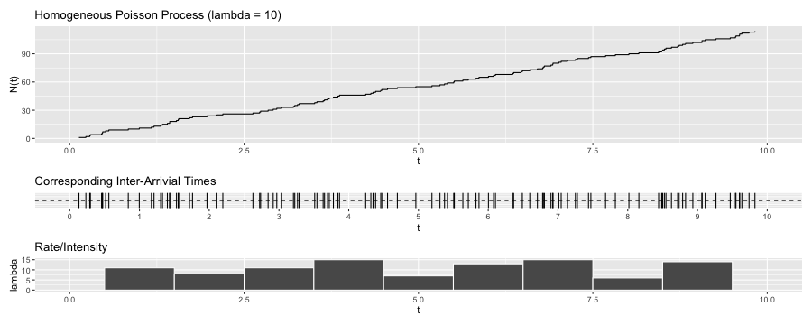

Major Professor: James Molyneux

Committee Members: Lisa Madsen & Charlotte Wickham

# Abstract

# 1 Introduction 

Real-world data are often spatial, temporal, or spatio-temporal in nature. Spatial data (e.g. soil properties, housing prices) often involve locations such as points and areas. Temporal data (e.g. sensor readings, stock prices) often involve times such as moments and intervals. Spatio-temporal data are data that relates to both locations and times. Examples of spatio-temoral data include forest inventories, remotely sensed images, earthquake epicenters, disease cases, map services and travel times, to name a few. **CITATIONS** 

There are various statistical models and methods suitable for modeling spatial, temporal, or spatio-temporal data, and which models to use depend on questions of interest. For this project, we focus primarily on the point process models. Point process models are useful for describing phenomena that occurs at random locations, times, or locations and times, and the questions of interests typically are: Does the rate for the occurrence of events vary with locations, times, or locations and times? Do events appear clustered? Do events trigger subsequent events? 

Spatial data can be broadly categoried into three types: geostatistical (point process) data, areal data, and point pattern data. **CITATIONS** We focus on the third category in which point pattern data are realizations of spatial point processes, and questions about point pattern data typically are: Is there clustering of events? Can we define a point process that captures the events? **CITATIONS** Examples of such models include Cox and cluster processes. On the other hand, when dealing with temporal data, (marked) point processes are sometimes used interchangeable with time series, and vice versa. One major distinction, though, is that in point processes, time intervals are treated as continuous, whereas in time series, they are treated as discrete. Examples of such models include (temporal) Poisson and Hawkes processes. 

Hawkes processes are also known as self-exciting point process. More specifically, the original Hawkes processes are temporal, whereas the more recently developed self-exciting point processes have been extended from temporal Hawkes processes to account for both the spatial and temporal aspects of the data. 

The defining characteristic of Hawkes processes is that it self-excites. In other words, the occurrence of an event increases the occurrence of future events nearby in space or time, but the events don't self-excite in perpetuity. In addition, more recent events exert more influence on the rate at which events occur given the history of such events, as compared to older events. For example, in seismology, an event can be an earthquake occurrence that causes aftershocks. In criminology, an event can be a gang rivalry that triggers retaliations following the gang crime. **CITATIONS** In both cases, the initial event can continue to spawn 'offspring' events and the 'offspring' events can spawn 'offspring' events of their own, but the spawns die out eventually. 

In addition to modeling earthquake epicenters in seismology and crime patterns in criminology, Hawkes processes have also been used in modeling events such as forest wildfires, insurance claims, financial transcations, social network events, neuron activities, and disease spread or transmission. **CITATIONS** Thus, it can be found in a wide variety of fields such as emergency and disaster management, insurance, finance, social network, neuroscience, and epidemiology. Recent work has extended the use of self-exciting point processes to novel applications such as mass shootings and...... **CITATIONS**. However, there is still much work to be done, which include computational advances to ease the burden of applying such models to bigger data sets, residual and model diagnostics, and methods that make the models more flexible and applicable. **CITATIONS: Souchard, Mohler's COVID-19, and Park's gang violence papers** 

Given the flexibility and applicability of Hawkess processes, it is surprising to see that Hawkess processes have not gained much attention from the machine learning communities, which would find their predictive capabilities beneficial. In addition, understanding Hawkes processes would benefit from knowing some of the relevant point processes (e.g. nonhomogeneous Poisson, Cox and cluster processes) which are often left out from graduate-level, introductory spatial statistics and stochastic processes courses. The objective of this project is to give an overview of various types of point processes so that readers of interest have the necessary background knowledge to understand Hawkes and self-exciting processes. The outline of this project is as follows: In *Section 2*, we introduce, define and discuss properties of counting processes, homogeneous and nonhomogeneous Poisson processes, Cox processes, cluster processes, Hawkes processes, and spatio-temporal self-exciting process. In *Section 3*, we discuss in particular the thinning algorithms (acceptance-rejection method) and simulate selected processes in 1D and 2D. In *Section 4 and 5*, we discuss recent and future work of Hawkes and self-exciting processes. 

# 2 Introductions, Definitions and Properties

## 2.1 Counting Process

Let us begin with the counting process. A counting process counts the occurrences (or numbers) of events over time, space, space-time or, in the most general sense, any metric space in which events occur and can be counted. **CITATIONS: Other or Daley and VereJones's An Introduction to the Theory of Point Processes** 

If we were to denote the time of arrival for customers at a super market, we would have a set of points in time in which we could count the number customers over some interval of time. On the other hand, if we consider the location of trees to occur at a point in space, then in some bounded region of the space, we could count the number of trees. An earthquake's epicenter would be the point in space but we also capture when the point appears in time. 

Let us restrict ourselves to the temporal domain so that interpretations are easier to follow. The counting process requires that the total number of events $N(t)$ up to some time $t$ to be greater than zero, the total number of events must be an integer, the counts always increase, and the number of events in specific time interval can be obtained by subtracting the number of events in previous interval from that in current interval. 

In addition, counting processes are independent, stationary, and homogeneous. In other words, the numbers of events $N(t)$ occurring in disjoint interval $t$ are independent, the distribution of the numbers of events depends only on the length of the interval $t$, and the transition probability between any two states at two times depends only on the difference between the states. **Reframe the transition probabilities part in non-stats language** 

Before formally defining a counting process, first we need to define stochastic processes and point processes. A stochastic process is a collection of random variables indexed by time $t$, space $s$ or space-time $t \times s$ **Notation?**, but we restrict ourselves to the time domain, again. We follow with...... to define a stochastic process and a point process 

**Definition 2.1.1** (Stochastic Process) A stochastic process is a family of random variables indexed by time $t$ and is defined as

$$
\{X_t\}_{t \in T} .
$$

**Definition 2.1.2** (Point Process) Let $\{T_i\}_{i \in \mathbb{N}}$ be a sequence of non-negative random variables such that $T_i < T_{i+1}$ $\forall i \in \mathbb{N}$, a point process on $R^{+}$ is defined as

$$
\{T_i\}_{i \in \mathbb{N}} .
$$

A point process relies on the occurrence of an event occurring at a specific point in time. Stochastic process, on the other hand, is more general. It can be related to a time interval, a waiting time, a state (e.g. blue or red) that changes over time, etc.

We follow with...... to define a counting process

**Definition 2.1.3** (Counting Process) Let $N(t)$ be the total number of events up to some time $t$ such that the values are nonnegative, integer valued, and nondecreasing, a stocastic process is said to be a counting process and is defined as 

$$
\{N(t), t \geq 0\} .
$$

Let us look at a more explicit example, which we show in Figure 1. Suppose that $N(t)$ counts the numbers of event up to some time $t$ and events occur at times $t = 0.1, 1, 1.5, 3, 5, etc$, then $N(2) = 3$ since events occuring at 0.01, 1, and 1.5 all occur in the time interval $(0, 2]$. Similiarily, $N(4) = 4$ since 4 events occur in the time interval $(0, 4]$. 

An alternative definition of a counting process is

**Definition 2.1.4** (Counting Process) Let $\{T_i\}_{i \in \mathbb{N}}$ be a point process, a counting process associated with $\{T_i\}_{i \in \mathbb{N}}$ is defined as

$$
N(t) = \sum_{i \in \mathbb{N}} I_{\{T_i \leq t\}}
$$

This equivalent definition may be more beneficial as we get into Poisson, cluster, etc processes in later sections because it is easier to see that for $i \in \mathbb{N}$, if $T_i \leq t$, the indication function $I_{\{T_i \leq t\}}$ is equal to $1$. Then, we sum up all the $1$s for events which have occurred. 

A useful corollary of counting process, which describes more formally some of the properties we stated above and will be helpful to understand as we move into Poisson processes and then beyond is

*Corollary* **2.1.1** A counting process satisfies that

1. $N(t) \geq 0$

2. $N(t)$ is an integer

3. If $t \leq t+h$, then $N(t) \leq N(t+h)$

4. If $t < t+h$, then $N(t+h) - N(t)$ is the number of events occur in the interval $(t, t+h]$

In other words, 1. An event has to occur for it to be "counted". 2. We either count an event or we don't. There is no event that sort of occurs that results in decimal value. 3. Counts always increase because events don't disappear. Once we observe an event and count it, it remains in the counts. 4. The number of events in specific time interval can be obtained by subtracting the number of events in previous interval from that in current interval. 

## 2.2 Poisson Process

The homogeneous Poisson process (HPP) is one of the simplest yet most-widely used point processes. **CITATIONS: Baddeley? ** HPPs can be used to model the number of events such as bus arrivals at a bus stop, car accidents at a site, or the document requests on a web server over time. As we alluded to previously with counting processes, HPPs can also be considered over a space which is often taken to be a two-dimensional plane or a three-dimensional volume. 

Like counting processes, HPPs are also independent, stationary, and homogeneous. In addition, we assume that the numbers of events $N(t)$ follows a Poisson distribution with a constant rate, $\lambda$, and the interarrival times between events, $W$, are exponentially distributed. HPPs can then be formally defined as 

**Definition 2.2.1** (Poisson Process) If the following conditions hold, a counting process $\{N(t), t \geq 0\}$ is said to be a Poisson Process with constant rate (or intensity) $\lambda > 0$ 

1. $N(0) = 0$

2. $N(t)$ has independent increments

3. $P(N(t + h)) - N(t) = 1)) = \lambda h + o(h)$

4. $P(N(t + h)) - N(t) > 1)) = o(h)$

where the function of little o $o(h)$ is given as 

$$
\lim_{h\to 0^+} \frac{o(h)} {h} = 0. 
$$

In other words, 1. An event has to occur for it to be "counted". 2. The occurance of an event in disjoint time intervals does not affect the probability of the occurance of another event. 3. $\lambda$ is the rate (events over time) at which points occur and is constant. 4. No more than 1 event can occur at the same location. 

An alternative way to think of HPP is that it is a uniformly "random" process. If we were to take a realization of a HPP over some time interval $(0, T]$ and "bin" the number of events occurring in some set of equal intervals, then the histogram for the realization would resemble a realization of a uniform distribution over time 0 to T. 

Let us look at a realization of a HPP in time, which we show in Figure 2. First, we note that the cumulative number of points is growing at a constant linear rate. In addition, we can see that the histogram of rate appears roughly uniform; the rates are roughly constant at $\lambda = 10$. Algorithm for simulating this HPP can be found in the Appendix section. 

HPP has similar properties as those of counting process; it is independent, stationary, and homogeneous. These properties follow nicely from the above definition. 

Additionally, let us denote the total number of events as $N(t)$ and the interarrival times between events as $W$. For example, let $T_0$ denote the starting time of the process while $T_1$ is the time of the first occurrence of event and $T_2$ is the time of the second occurrence of event. The elapsed time between the start of the process and first event is $W_1$ and the elapsed time between the first event and second event is $W_2$. 

**Check reference > Chen, 2016 > p3, 4, 5 but check other sources too!** 

For an HPP, the number of events in any time interval $N(t)$ are Poisson distributed. More formally, we can say that the number of events in any time interval $(t, t+h]$, $N((t, t+h])$ $\sim Pos(\lambda h)$. That is, for all $t, h \geq 0$ and $n = 0, 1,...$, 

*Definitely check the notation, both above and below this line. For the notation below, it's not clear to me why P(N(t+h) - N(t) = n) is equal to P(N(h) - N(0)) and further why this is equal to P(N(h) = n). It seems that if n events occur after time t but before time t+h, that it wouldn't necessarily be equal to the probability that N(h) = n since N(h) starts from time t = 0.*

$$
P(N(t+h) - N(t) = n) = P(N(h) - N(0)) = P(N(h) = n) = \frac{(\lambda h)^n e^{-\lambda h}} {n!} . \ \ 
$$

The interarrival times $W$ are exponentially distributed. More formally, the interarrival times $W$, $\overset{iid}{\sim} exp(\frac{1} {\lambda})$. That is, for rate $\lambda > 0$, the interarrival time $W_i$ $i=1,2,...$,  

$$
P(W_1 > h) = P(N(t) = 0) = e^{-\lambda h}.
$$

This is because p($1^{st}$ arrivial arrives after time $t$) is the same as p(no arrival in the interval (0,$t$]). Similarly, $W_2$ also $\sim exp(\frac{1} {\lambda})$ since

$$
P(W_2 > t | W_1 = t) = P(N(t + h) - N(t) | N(t) - N(t^{-}) = 1) = P(N(t + h) - N(t)) = P(N(h) = 0) = e^{-\lambda h}. 
$$

## 2.3 Nonhomogeneous Poisson Process

Assuming that the rate in which points occur is constant is often not realistic in practice. We may want a model that allows for more flexibility. Nonhomogeneous Poisson processes (NPPs) are a generalization of homogeneous Poisson processes that allow for the rate (or intensity) $\lambda$ to vary as function of time $t$ or space $s$. 

We assumed previously that the intensity $\lambda$ is constant. If we have reasons to believe that the intensity is not constant, we should use a NPP instead. This would be the case if, as in the supermarket example, we have reasons to believe that the arrival rate of customers is higher during lunch time as compared to say, 2am, or, as in the trees in a forest example, we speculate that environmental factors such as temperature, rainfall and light affect the spatial distribution of the trees. 

Contrary to HPP, NPP is independent but not stationary nor homogeneous. HPP has stationary increments since the distribution of the numbers of events $N(t)$ that occur in any interval of time $t$ depends only on the length of the interval $t$ but not the location of the interval $t$. In contrast, NPP does not have stationary increments since the distribution of $N(t)$ can change when shifted in $t$. Since stationary implies homogeneity, NPP is nonhomogeneous. 

Recall that for HPP, we assume that the numbers of events $N(t)$ follows a Poisson distribution with a constant intensity $\lambda$, for NPP, we assume that $N(t)$ follows a Poisson distribution too but with an intensity function $\lambda(t)$ such that the intensity now varies with a function of time. This then leads to the following definiton of a NPP

**Definition 2.3.1** (Nonhomogeneous Poisson Process) If the following conditions hold, a counting process $\{N(t), t \geq 0\}$ is said to be a nonhomogeneous Poisson Process with intensity function of time $\lambda(t), t > 0$

1. $N(0) = 0$

2. $N(t)$ has independent increments

3. $P(N(t + h)) - N(t) = 1)) = \lambda(t) h + o(h)$

4. $P(N(t + h)) - N(t) > 1)) = o(h)$ 

Nonhomogeneous Poisson process has additional properties such as if the number of events in any interval $t$, $N(t)$, $\sim Pos(\Lambda (t) = \int_{0}^{t} \lambda (v) dv)$. That is, for all $v, t \geq 0$ and $n = 0, 1,...$, 

$$
P(N(t)= n) = \frac{(\int_{0}^{t} \lambda (v) dv)^n e^{-\int_{0}^{t} \lambda (v) dv}} {n!}. \ \ 
$$

Further, the law of occurrence for the next point can be determined by 

$$
P(N(t,t+h] = 0) = e^{- \int_{t}^{t+h} \lambda (v) dv} .
$$

## HPP and NPP in Space

*It might make sense though, for the next section, to introduce at least the HPP and NPP spatial proceses so that we can emphasize the differences between those particular point processes.*

*Here would be a good place for a plot where you compare the spatial occurrence of HPP and NPPs. You can then end this section with a brief explanation of the plots.* 

For HPP in space, it follows that for $u \in S \subseteq R^d$ and $d = 2$, 

$$
P(N(u) = n) = \frac{(\lambda |u|)^n e^{-\lambda |u|}} {n!} .
$$

where $|u|$ denotes the area of $U$. 

For NPP in space, if we let 

$$
\lambda(x, y) = e^{- (x^2 + y^2)}
$$

then the intensity function becomes 

$$
\Lambda(u) = \int_u \lambda (x) dxdy.
$$

## A Motivating Example 

Before we delve further into various point processes, let us first look at a motivating example, which we show in Figure 3. We demonstrate the processes in space so that visualizations are easier to look at and comprehend. 

The figure on the left, middle 1, middle 2 and right is realization of HPP (homogeneous Poisson process) with constant $rate = 100$, NPP (nonhomogeneous Poisson process) with $intensity \ function = 400xy$, Cox process with $intensity \ function = exp(1, 1/100)$ and Matern cluster process with $kappa = 20, r = 0.05, mu = 5$ respectively. 

We can see that while HPP points appear randomly spaced, NPP points seem to concentrate at the upper-right corner. As a preview, both Cox process and Matern cluster process points appear clustered, but the way the points cluster differ. Points in Cox process cluster accordingly to some specified distribution, whereas points in cluster process cluster in some defined area. We elaborate more and discuss in details Cox and cluster process in the next section. 

*It might make sense though, for the next section, to introduce at least the HPP and NPP spatial proceses so that we can emphasize the differences between those particular point processes.*

## 2.4 Cox and Cluster Process

Even more flexible models than NPP are Cox and cluster processes that allow dependence between events. Previously, we assume independence between events. That is, whether events occur at a constant rate $\lambda$ (e.g. HPP) or depend on an intensity function $\lambda (t)$ (e.g. NPP), they occur independently. Here, we discuss models that allow dependence between events. 

Examples that can be modelled using Cox and cluster processes include seedlings and saplings of California redwood, locations of emergent plants, and locations of trees. In these examples, the patterns appear to be clustered. 

The differences between Cox process and cluster process are such that points in Cox process cluster accordingly to some specified random field, whereas points in cluster process cluster in some bounded region. 

We can think of Cox process as a hierarchical model with two levels and cluster process such as Neyman-Scott process a hierarchical model with three levels. In Cox process, the first level is a Poisson process and the second level can be a non-negative random variable or random field. In cluster process, the first level is to generate 'parent' (or 'center') points, which can be a Poisson process or any other process. The second level is to generate counts, which is a non-negative interger-valued random variable, and the third level is to generate 'offspring' points for each 'parent' point and the corresponding count. 

In Cox processes (or doubly stochastic Poisson processes), randomness arises from two parts. Not only the randomness occurs at different location of the time interval as in the case of a NPP, but instead of governing by a determinist function $\lambda(t)$ also as in the case of a NPP, the governing function $\Lambda (u)$ is also random. In other words, the intensity function $\Lambda (u)$ is also treated as random. **PICK ONE TO PLOT THEN TALK IN DETAILS**. For example, in mixed Poisson process,...... Other examples of Cox processes include log Gaussian Cox process and shot noise Cox process. 

In cluster processes, randomness arises from three parts: First, 'parent' points **Y** is generated. Next, each 'parent' point $y_i \in$ **Y** gives rise to a random number of 'offspring' points $z_{ij}$. Then, all the 'offspring' points $Z_{ij}$ form a cluster process **X** and only **X** is observed. 

Specific models of cluster processes depend on the choices of assumptions. Matern cluster process, for example, involves generating homogeneous Poisson parents and each parent gives rise to Poisson number of offspring uniformmly distributed in a disc of radius $r$ centered around the parent. Other examples of cluster processes include Neyman-Scott process and Thomas cluster process. 

**Definition 2.4.1** (Cox Process) Let $\Lambda = (\Lambda (u))_{u \in S \subseteq R^d}$ be a non-negative random field such that $\Lambda (u)$ is a locally integrable function. If X | $\Lambda$ $\sim Pos (\Lambda)$, then X is said to be a Cox process driven by $\Lambda$ with intensity function $\lambda (u) = E(\Lambda (u))$. That is, 

$$
P(N(u) = n) = \frac{(\lambda (u))^n e^{-\lambda (u)}} {n!} = \frac{(E(\Lambda (u)))^n e^{-E(\Lambda (u))}} {n!} = 
$$

(?)

$$
\Lambda (u) \overset{a.s.} =  \int_u \lambda (x) dx
$$

(?) How to get here

$$
= \int_{0}^{\infty} \frac{x^n e^{-x} F_u(dx)} {n!}
$$

Note. $\Lambda$ is a random field means that $\Lambda (u)$ is a random variable $\forall u \in S$.

Note. $\Lambda (u)$ is a locally integrable function means that $E(\Lambda (u))$ exists and is locally intergrable with probabiliy 1. 

Cox processes have the following propertities

1. Propertities of Cox process X follow immediately from the properties of Poisson process X | $\Lambda$. For example, if $\Lambda$ is stationary, then X is stationary. 

2. For bounded $B \subseteq S$, the void probabilities are given by

$$
\nu (B) = E(P(N(B) = 0) | \Lambda) = E(exp (- \int_B Z(u) du)). 
$$

Note. The void (or avoidance) probability $\nu$ is defined as the probability that no points of a point process N existing in B where B is a subset of the underlying space $R^d$. 

**Definition 2.4.2** (Cluster Process) Let $x$ be points in a point process $N$ and replacing every $x$ with a cluster of points $N_x$, then the union of all the clusters forms a cluster process $N_c$. That is, 

$$
N_c = \bigcup_{x \in N} N_x
$$

Note. Each $N_x$ is a finite point process 'centered' at $x$ and it is assumed that each $N_x$ is independent of one another. 

Note. $N_x$ can be thought of as 'offspring'?? 

In addition, condition on..., the cluster process has the intensity function...

Cluster processes have the following model assumptions 1. Poisson parents, 2. independent clusters, 3. identically distributed clusters, 4. offsprings independent within a cluster, 5. Poisson number of offsprings, and 6. isotropic clusters. 

In other words, 1. 'Parent' points follow a Poisson distribution. 2. Clusters are independent of each other. 3. Clusters, when shifted, have the same distributions. 4. The locations of 'offspring' points of each parent point are independently and identically distributed. 5. The numbers of 'offspring' points of each parent point follow a Poisson distribution. 6. The distribution of 'offspring' points for each parent point depends only on the distance between the 'parent' and the 'offspring'. 

Under assumption 1 - 4, it is a Neyman-Scott process. Under assumption 1 - 5, the cluster process is a Cox process. Under assumption 1 - 6, it can be a Matern cluster process or a Thomas cluster process. 

## 2.5 Hawkes Process 

Hawkes process is also known as a self-exciting point process. Like Cox and cluster process, the model also allows dependence between events. However, their dependence differs. In Hawkes process, the occurrence rate of the events depends not only on time $t$ but also past events $\mathcal{H}_{t}^{N}$ up to some time $t$. Neither Cox nor cluster process captures the past history of events. 

Examples that can be modelled using Hawkes processes include locations of earthquake epicenters, locations of crimes, and locations of patients with a disease. In these examples, the occurrence of an event increases the occurrence of subsequent events. 

Because the intensity is now as a function of past history, a defining characteristic of Hawkes processes is that it self-excites. **WHY?** Another characteristic is that more recent events exert more influence on the intensity, as compared to older events. **HOW?** These characteristics are captured by the triggering part $\phi(\cdot)$ of the intensity function $\lambda(t | \mathcal{H}_t)$. 

We can think of Hawkes process as a model that incorporates cluster process and conditional intensity function. 

First we want to define conditional intensity function since it is through which a point process is fully characterized.

Conditional intensity function can be thought as the instantaneous rate of events per unit time, space or space-time. Restricting ourselves to the time domain again, for example, for HPP, $\lambda(t | \mathcal{H}_t)$ = $\lambda$, for HPP, $\lambda(t | \mathcal{H}_t)$ = $\lambda(t)$, for Cox process, $\lambda(t | \mathcal{H}_t)$ is a Papangelou conditional intensity function. For Hawkes process, $\lambda(t | \mathcal{H}_t)$ is a function of past history. 

**Definition 2.5.0** (Conditional Intensity Function) Let $N(t)$ be the numbers of events $N(t)$ that occur in any interval of time $t$ , the conditional intensity function $\lambda(t)$ with respect to $\mathcal{H}_t$ is defined as 

$$
\lambda(t | \mathcal{H}_t) = \lim_{h\to 0^+} \frac {P(N(t, t+h] > 0 | \mathcal{H}_t)} {h}= \lim_{h\to 0^+} \frac {E(N (t, t + h) | \mathcal{H}_t)} {h} 
$$

where $\mathcal{H}_t$ is the history prior to time $t$ here in the case of a Hawkes process.

\newpage

<!--  -->

**Definition 2.5.1** (Hawkes Process) A counting process $\{N(t), t \geq 0\}$ associated with past events $\{\mathcal{H}_{t}^{N}, t > 0\}$ is said to be a Hawkes process with conditional intensity function $\lambda(t | \mathcal{H}_{t}^{N}), t > 0$ and takes the form 

$$
\lambda(t | \mathcal{H}_{t}^{N}) = \lambda_0(t) + \sum^{}_{i: T_i < t} \phi( t - T_i)
$$

where

- $\lambda_0(t)$ is the base intensity function (or $\mu$ the constant background rate)

- $T_i < t$ are the events time occur before current time $t$ 

- $\phi(\cdot)$ is the kernel function (or $g(\cdot)$ the triggering function) through which intensity function depends on past events 

- $\mathcal{H}_{t}^{N}$ is the natural filtration (or simply $\mathcal{H}_{t}^{}$ the past history) which represents the internal history of N up to time $t$

*Corollary* **2.5.1** Hawkes process satisfies that

1. $N(t) = 0$

2. $\lambda(t | \mathcal{H}_{t}^{N}) = \lambda_0(t) + \int_{-\infty}^{t} \phi( t - T_i)dN(s) = \lambda_0(t) + \sum^{}_{i: T_i < t} \phi( t - T_i)$

3. $P(N(t + h)) - N(t) = 1) | \mathcal{H}_{t}^{N}) = \lambda(t) h + o(h)$

4. $P(N(t + h)) - N(t) > 1) | \mathcal{H}_{t}^{N}) = o(h)$

**2.5.1** Choices of $\phi(\cdot)$ include, for example, exponentially decaying function and power-law kernel, and they take the form of 

$$
\phi(x) = \alpha e^ {-\beta x} 
$$

$$
\phi(x) = \frac{\alpha} { (x + \beta) ^ {\eta + 1}}.
$$

**2.5.2** There are two ways to view Hawkes processes

1. Intensity-based Hawkes Process

Here, Hawkes process is defined through conditional intensity process. 

In **Section 3.5**, we discuss algorithm for simulating intensity-based Hawkes process in details.

2. Cluster-based Hawkes Process

Alternatively, Hawkes process can also be defined through marked Poisson cluster process. 

## 2.6 Spatio-Temporal Hawkes Process 

Spatio-temporal Hawkes processes is an extention of temporal Hawkes processes. Recall that temporal Hawkes processes take the form of 

$$
\lambda(t | \mathcal{H}_{t}) = \mu + \sum^{}_{i: T_i < t} g(t - t_i) .
$$

Spatio-temporal Hawkes processes take the form of 

$$
\lambda(t | \mathcal{H}_{t}) = \mu(s) + \sum^{}_{i: T_i < t} g(s - s_i, t - t_i) .
$$

where 

- ${s_i, i = 1,2,...}$ are the sequence of locations of events  

- ${t_i, i = 1,2,...}$ are the times of events. 

Next, we simulate some of the aforementioned point processes in 1D ($\mathbb{R}^1$) through algorithms and the processes in 2D ($\mathbb{R}^2$) using `R` packages.  

# 3 Algorithms and Simulations

## 3.1 Poisson Process

See the Appendix section for Algorithm 1: HPP. 

## 3.2 Nonhomogeneous Poisson Process

Algorithm 2: NPP is omitted. Instead, we discuss the thinning algorithm in details and show Algorithm 3 in the next section. 

## 3.3 Hawkes Process 

In this example, we use the thinning algorithm (or acceptance-rejection method) to simulate a (temporal) Hawkes process since it is one of the most popular choices for simulating both temporal and spatio-temporal NPP. 

Broadly put, thinning algorithm involves randomly deleting points from a point pattern. **ELABORATE MORE**. 

## Algorithm 3

Figure 4 as shown previously is a realization of a Hawkes process with the exponentially decaying triggering function ($\mu = 0.5, \alpha = 0.7, \beta = 0.5$). 

## 3.6 Simulations in 2D using the **spatstat** package in `R`

All of the corresponding plots can be found in the Appendix section and all of the plots in this section are created using the **spatstat** package in `R`. 

**HPP**

**NPP**

**Cox Process**

**Matern Cluster Process**

Simulations of Matern cluster process are generated using the `rMatClust` function. Specifically, the process involves generating homogeneous Poisson parents and each parent gives rise to Poisson number of offspring uniformmly distributed in a disc of radius $r$ centered around the parent. `kappa` controls the intensity of the cluster centers and allows us to specify the number of clusters. `r` specifies how far away cluster is from one another in radius, and `mu` gives the mean number of points per cluster. 

# 4 Conclusions and Discussion

# 5 Recent Advancement

\newpage

# Acknowledgments

\newpage

# Reference

Chen, Y. (2016). Thinning algorithms for simulating point processes. Florida State University, Tallahassee, FL.

Obral, K. (2016). Simulation, estimation and applications of hawkes processes. (Master's thesis, University of Minnesota, Twin Cities, United States). 

Rizoiu, M. A., Lee, Y., Mishra, S., & Xie, L. (2017). A tutorial on hawkes processes for events in social media. arXiv preprint arXiv:1708.06401. 

Krishna, R. (2015). Simulation of Non-Homogeneous Poisson Processes. 

Pasupathy, R. (2010). Generating homogeneous poisson processes. Wiley encyclopedia of operations research and management science. 

# Terminology

[Stochastic Process](https://www.probabilitycourse.com/chapter10/10_1_0_basic_concepts.php)

[Counting Processes](https://www.probabilitycourse.com/chapter11/11_1_1_counting_processes.php)

[Poisson Process](https://www.probabilitycourse.com/chapter11/11_1_2_basic_concepts_of_the_poisson_process.php)

[Nonhomogeneous Poisson Process](https://www.probabilitycourse.com/chapter11/11_1_4_nonhomogeneous_poisson_processes.php)

[Cox Process](https://en.wikipedia.org/wiki/Point_process#Cox_point_process)

\newpage 

# Appendix

## Algorithm 1: HPP

## Algorithm 2: NPP

## Algorithm 3: Hawkes

