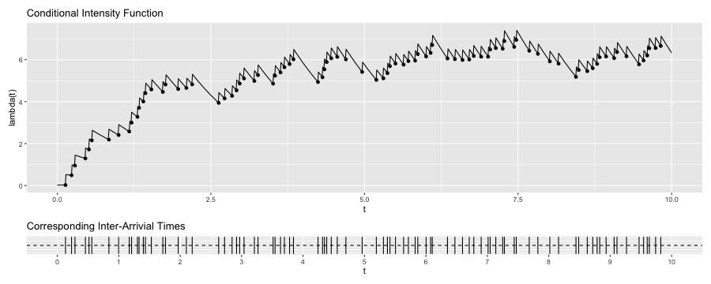

Major Professor: James Molyneux

**James' to do:**
**1. Help with references.**
**2. Double-check the notation, specifically for Poisson processes**

Committee Members: Lisa Madsen & Charlotte Wickham

# Abstract

# 1 Introduction

Real-world data are often spatial, temporal, or spatio-temporal in nature. Spatial data (e.g. soil properties, housing prices) often involve locations such as points and areas. Temporal data (e.g. sensor readings, stock prices) often involve times such as moments and intervals. Spatio-temporal data are data that relates to both locations and times. Examples of spatio-temoral data include forest inventories, remotely sensed images, earthquake epicenters, disease cases, map services and travel times, to name a few.

There are various statistical models and methods suitable for modeling spatial, temporal, or spatio-temporal data, and which models to use depend on questions of interest. For this project, we focus primarily on the point process models. Point process models are useful for describing phenomena that occurs at random locations, times, or locations and times, and the questions of interests typically are: Does the rate for the occurrence of events vary with locations, times, or locations and times? Do events appear clustered? Do events trigger subsequent events?

Spatial data can be broadly categoried into three types: geostatistical (point process) data, areal data, and point pattern data (Cressie, 2015). We focus on the third category in which point pattern data are realizations of spatial point processes, and questions about point pattern data typically are: Is there clustering of events? Can we define a point process that captures the events? **CITATIONS** Examples of such models include Cox and cluster processes. On the other hand, when dealing with temporal data, (marked) point processes are sometimes used interchangeable with time series, and vice versa **CITATIONS**. One major distinction, though, is that in point processes, time intervals are treated as continuous, whereas in time series, they are treated as discrete. Examples of such models include (temporal) Poisson and Hawkes processes.

Hawkes processes are also known as self-exciting point process. More specifically, the original Hawkes processes are temporal, whereas the more recently developed self-exciting point processes have been extended from temporal Hawkes processes to account for both the spatial and temporal aspects of the data.

The defining characteristic of Hawkes processes is that it self-excites. In other words, the occurrence of an event increases the occurrence of future events nearby in space or time, but the events don't self-excite in perpetuity. In addition, more recent events exert more influence on the rate at which events occur given the history of such events, as compared to older events. For example, in seismology, an event can be an earthquake occurrence that causes aftershocks. In criminology, an event can be a gang rivalry that triggers retaliations following the gang crime. In both cases, the initial event can continue to spawn 'offspring' events and the 'offspring' events can spawn 'offspring' events of their own, but the spawns die out eventually.

In addition to modeling earthquake epicenters (Ogata, 1988, 1998) and crime patterns (Mohler et al.,2011; Reinhart & Greenhouse, 2018), Hawkes processes have also been used in modeling events such as forest wildfires (Peng, et al., 2005), insurance claims (Stabile et al., 2010), financial transcations (Bauwens and Hautsch, 2009; Embrechts et al., 2011; Bacry et al., 2015), social network events (Zhao et al., 2015; Rizoiu et al., 2017), neuron activities (Johnson, 1996; Gerhard et al, 2017), and disease spread or transmission (Meyer et al., 2012; Meyer & Held, 2014). Thus, it can be found in a wide variety of fields such as emergency and disaster management, insurance, finance, social network, neuroscience, and epidemiology. Recent work has extended the use of self-exciting point processes to novel applications such as mass shootings (Boyd & Molyneux, 2021), COVID-19 transmission (Chiang et al., 2020), and gang violence (Park et al., 2021). However, there is still much work to be done, which include computational advances to ease the burden of applying such models to bigger data sets (Holbrook et al., 2021), residual and model diagnostics, and methods that make the models more flexible and applicable.

Given the flexibility and applicability of Hawkess processes, it is surprising to see that Hawkess processes have not gained much attention from the machine learning communities, which would find their predictive capabilities beneficial. In addition, understanding Hawkes processes would benefit from knowing some of the relevant point processes (e.g. nonhomogeneous Poisson, Cox and cluster processes) which are often left out from graduate-level, introductory spatial statistics and stochastic processes courses. The objective of this project is to give an overview of various types of point processes so that readers of interest have the necessary background knowledge to understand Hawkes and self-exciting processes. The outline of this project is as follows: In *Section 2*, we introduce, define and discuss properties of counting processes, homogeneous and nonhomogeneous Poisson processes, Cox processes, cluster processes, Hawkes processes, and spatio-temporal self-exciting process. In *Section 3*, we discuss recent and future work of Hawkes and self-exciting processes. In *Appendix*, we discuss in particular the thinning algorithms (acceptance-rejection method) and the **spatstat** package of `R` that are used to simulate selected processes in 1D and 2D, respectively.

# 2 Introductions, Definitions and Properties

## 2.1 Counting Process

A counting process counts the occurrences (or numbers) of events over time, space, space-time or, in the most general sense, any metric space in which events occur and can be counted (Daley & Vere-Jones, 2003).

If we were to denote the time of arrival for customers at a super market, we would have a set of points in time in which we could count the number customers over some interval of time. On the other hand, if we consider the location of trees to occur at a point in space, then in some bounded region of the space, we could count the number of trees. An earthquake's epicenter would be the point in space but we also capture when the point appears in time.

Let us restrict ourselves to the temporal domain so that interpretations are easier to follow. The counting process requires that the total number of events $N(t)$ up to some time $t$ to be greater than zero, the total number of events must be an integer, the counts always increase, and the number of events in specific time interval can be obtained by subtracting the number of events in previous interval from that in current interval. In addition, counting processes are independent, stationary, and homogeneous. In other words, the numbers of events $N(t)$ occurring in disjoint interval $t$ are independent, the distribution of the numbers of events depends only on the length of the interval $t$, and the transition probability between any two states at two times depends only on the difference between the states. **Reframe the transition probabilities part in non-stats language**

Before formally defining a counting process, first we need to define stochastic processes and point processes. A stochastic process is a collection of random variables indexed by time, $t$, space, $s$ or space-time, $(s, t)$, but we restrict ourselves to the time domain, again. We follow with Obral (2016) to define a stochastic process and a point process

**Definition 2.1.1** (Stochastic Process) A stochastic process is a family of random variables indexed by time $t$ and is defined as
$$
\{X_t\}_{t \in T.}
$$

**Definition 2.1.2** (Point Process) Let $\{T_i\}_{i \in \mathbb{N}}$ be a sequence of non-negative random variables such that $T_i < T_{i+1}$ $\forall i \in \mathbb{N}$, a point process on $R^{+}$ is defined as
$$
\{T_i\}_{i \in \mathbb{N.}}
$$

A point process relies on the occurrence of an event occurring at a specific point in time. Stochastic processes, on the other hand, are more general. It can be related to a time interval, a waiting time, a state (e.g. blue or red) that changes over time, etc.

A counting process is then defined as follows

**Definition 2.1.3** (Counting Process) Let $N(t)$ be the total number of events up to some time $t$ such that the values are nonnegative, integer valued, and nondecreasing, a stochastic process is said to be a counting process and is defined as
$$
\{N(t), t \geq 0\} .
$$

Let us look at a more explicit example, which we show in Figure 1. Suppose that $N(t)$ counts the numbers of events up to some time $t$ and events occur at times $t = 0.1, 1, 1.5, 3, 5$, etc. then $N(2) = 3$ since events occuring at 0.01, 1, and 1.5 all occur in the time interval $(0, 2]$. Similiarily, $N(4) = 4$ since 4 events occur in the time interval $(0, 4]$.

An alternative definition of a counting process is

**Definition 2.1.4** (Counting Process) Let $\{T_i\}_{i \in \mathbb{N}}$ be a point process, a counting process associated with $\{T_i\}_{i \in \mathbb{N}}$ is defined as
$$
N(t) = \sum_{i \in \mathbb{N}} I_{\{T_i \leq t\}}
$$

This equivalent definition may be more beneficial as we get into Poisson, cluster, etc. processes in later sections because it is easier to see that for $i \in \mathbb{N}$, if $T_i \leq t$, the indicator function $I_{\{T_i \leq t\}}$ is equal to $1$. Then, we sum up all the $1$s for events which have occurred.

A useful corollary of counting process, which describes more formally some of the properties we stated above and will be helpful to understand as we move into Poisson processes and then beyond is

*Corollary* **2.1.1** A counting process satisfies that

1. $N(t) \geq 0$

2. $N(t)$ is an integer

3. If $t \leq t+h$, then $N(t) \leq N(t+h)$

4. If $t < t+h$, then $N(t+h) - N(t)$ is the number of events occur in the interval $(t, t+h]$

In other words, 1. An event has to occur for it to be counted. 2. We either count an event or we don't. There is no event that sort of occurs that results in decimal value. 3. Counts always increase because events don't disappear. Once we observe an event and count it, it remains in the counts. 4. The number of events in specific time interval can be obtained by subtracting the number of events in previous interval from that in the current interval.

## 2.2 Poisson Process

The homogeneous Poisson process (HPP) is one of the simplest yet most-widely used point processes (Baddeley et al., 2015). HPPs can be used to model the number of events such as bus arrivals at a bus stop, car accidents at a site, or the document requests on a web server over time. As we alluded to previously with counting processes, HPPs can also be considered over a space which is often taken to be a two-dimensional plane, such as the surface of Earth, or a three-dimensional volume, such as the interior of Earth.

Like counting processes, HPPs are also independent, stationary, and homogeneous. In addition, we assume that the numbers of events $N(t)$ follows a Poisson distribution with a constant rate, $\lambda$, and the interarrival times between events, $W$, are exponentially distributed. HPPs can then be formally defined as

We follow with Obral (2016) and Chen (2016) to define a Poisson process

**Definition 2.2.1** (Poisson Process) If the following conditions hold, a counting process $\{N(t), t \geq 0\}$ is said to be a Poisson Process with constant rate (or intensity) $\lambda > 0$

1. $N(0) = 0$

2. $N(t)$ has independent increments

3. $P(N(t + h)) - N(t) = 1)) = \lambda h + o(h)$

4. $P(N(t + h)) - N(t) > 1)) = o(h)$

where the function of little o $o(h)$ is given as
$$
\lim_{h\to 0^+} \frac{o(h)} {h} = 0.
$$

In other words, 1. An event has to occur for it to be counted. 2. For any disjoint time intervals, the occurrence of an event does not affect the probability of the occurrence of one another event. 3. $\lambda$ is the rate (events over time) at which points occur and is constant. 4. No more than 1 event can occur at the same location.

An alternative way to think of HPP is that it is a uniformly random process. If we were to take a realization of a HPP over some time interval $(0, T]$ and "bin" the number of events occurring in some set of equal intervals, then the histogram for the realization would resemble a realization of a uniform distribution over time 0 to T.

Let us look at a realization of a HPP in time, which we show in Figure 2. First, we note that the cumulative number of points is growing at a constant linear rate. In addition, we can see that the histogram of rate appears roughly uniform; the rates are roughly constant at $\lambda = 10$. The algorithm used for simulating this HPP can be found in the Appendix section.

For an HPP, the number of events in any time interval $N(t)$ are Poisson distributed. More formally, we can say that the number of events in any time interval $(t, t+h]$, $N((t, t+h])$, $\sim Pos(\lambda \cdot h)$. That is, for all $t, h \geq 0$ and $n = 0, 1,...$,
$$
P(N(t+h) - N(t) = n) = \frac{(\lambda h)^n e^{-\lambda h}} {n!} . \ \ 
$$

Additionally, let us denote the total number of events as $N(t)$ and the interarrival times between events as $W$. For example, let $T_0$ denote the starting time of the process while $T_1$ is the time of the first occurrence of event and $T_2$ is the time of the second occurrence of event. The elapsed time between the start of the process and first event is $W_1$ and the elapsed time between the first event and second event is $W_2$. The interarrival times $W$ are exponentially distributed. More formally, the interarrival times $W$, $\sim exp(\frac{1} {\lambda})$. That is, for rate $\lambda > 0$, the interarrival time $W_i$ $i=1,2,...$,
$$
P(W_1 > h) = P(N(h) = 0) = e^{-\lambda h}.
$$

This is because the probabiilty of the first point arriving after time $h$ can be thought of as the probability that the first point does *not* arrive in the time interval $(0, h]$. Similarly, $W_2$ is also $\sim exp(\frac{1} {\lambda})$ since
$$
P(W_2 > h | W_1 = t) = P(N(t + h) - N(t) | N(t) - N(t^{-}) = 1) = P(N(t + h) - N(t) = 0) = P(N(h) = 0) = e^{-\lambda h}. 
$$

## 2.3 Nonhomogeneous Poisson Process

Assuming that the rate in which points occur is constant is often not realistic in practice. We may want a model that allows for more flexibility. Nonhomogeneous Poisson processes (NPPs) are a generalization of homogeneous Poisson processes that allow for the rate (or intensity) $\lambda$ to vary as function of time $t$ or space $s$.

We assumed previously that for the HPP the intensity $\lambda$ is constant. If we have reasons to believe that the intensity is not constant, we should model as a NPP instead. This would be the case if, as in the supermarket example, we have reasons to believe that the arrival rate of customers is higher during lunch time as compared to say, 2am, or, as in the trees in a forest example, we speculate that environmental factors such as temperature, rainfall and light affect the spatial distribution of the trees.

Contrary then to the HPP, NPPs are independent but not stationary nor homogeneous. HPP has stationary increments since the distribution of the numbers of events $N(t)$ that occur in any interval of time $t$ depends only on the length of the interval $t$ but not the location of the interval $t$. In contrast, NPP does not have stationary increments since the distribution of $N(t)$ can change when shifted in $t$. Since stationary implies homogeneity, NPP is nonhomogeneous.

For HPP, we assume that the numbers of events in any time interval $N(t)$ follows a Poisson distribution with a constant intensity $\lambda$. For NPP, we assume that $N(t)$ follows a Poisson distribution too but with an intensity function $\lambda(t)$ such that the intensity now varies with a function of time. This then leads to the following definiton of a NPP (Obral, 2016; Chen, 2016)

**Definition 2.3.1** (Nonhomogeneous Poisson Process) If the following conditions hold, a counting process $\{N(t), t \geq 0\}$ is said to be a nonhomogeneous Poisson Process with intensity function of time $\lambda(t), t > 0$

1. $N(0) = 0$

2. $N(t)$ has independent increments

3. $P(N(t + h)) - N(t) = 1)) = \lambda(t) h + o(h)$

4. $P(N(t + h)) - N(t) > 1)) = o(h)$

Nonhomogeneous Poisson processes have additional properties such as if the number of events in any time interval $(t, t+h]$, denoted as $N((t, t+h])$, $\sim Pos(\Lambda (t) = \int_{t}^{t+h} \lambda (v) dv)$. That is, for all $v, t, h \geq 0$ and $n = 0, 1,...$,
$$
P(N(t+h) - N(t) = n) = \frac{(\int_{t}^{t+h} \lambda (v) dv)^n e^{-\int_{t}^{t+h} \lambda (v) dv}} {n!} \ \
$$
where $\lambda(v)$ again denotes a non-constant rate function.

Further, occurrence of the next point can be determined by utilizing the exponential distribution with
$$
P(N(t,t+h] = 0) = e^{- \int_{t}^{t+h} \lambda (v) dv} .
$$

## A Motivating Example

Before we delve further into other point processes, let us look at a motivating example, which we show in Figure 3. We demonstrate the processes in space so that visualizations are easier to look at and comprehend.

HPP in space is also called complete spatial randomness (CSR) (Baddeley et al., 2015). For HPP in space, the number of events in $u$ with area $|u|$, denoted as $N(u)$, $\sim Pos(\lambda |u|)$. The left figure of Figure 3 is a realization of a HPP with constant $rate = 100$. We can see that HPP points appear uniformly distributed in $u$.

For NPP in space, the number of events in $u$, denoted as $N(u)$, $\sim Pos(\int_{u}^{} \lambda (v) dv)$. The right figure of Figure 3 is a realization of a NPP with $intensity \ function = 400xy$. NPP points are not uniformly distributed; they are distributed according to the intensity function of the process. In this example, the points appear to concentrate at the upper-right corner.

{height=50%, width=50%}

## 2.4 Cox and Cluster Process

Even more flexible models than NPP are Cox and cluster processes. Whereas, previously assumed independence between events which occur at a constant rate $\lambda$ for the HPP or were independent but depend on an intensity function $\lambda (t)$ for the NPP, we now discuss models that allow for the relaxation of this independence assumption.

Examples that are potentially better modelled as Cox processes than HPP include locations of emergent bramble cane (blackberry) plants and *Beilschmiedia* trees (Baddeley et al., 2015). In these examples, there appear to be some underlying random variables or random fields (e.g. light, water, humidity, soil) such that it is more likely to observe the emergent plants or *Beilschmiedia* trees preferentially in some areas as opposed to others.

**You might be able to squeeze the idea of the "random intensity function" two paragraphs before this one when we introduce the idea that the intensity function of the Cox process relies on a set of "random variables". Then you can spend a paragraph talking more about how to points in the Cox process occur (Similar to what you do in the next paragraph with cluster processes. For example: "When the intensity of the Cox process is relatively high in some region of space, then points tend to occur more frequently. And again, the intensity of the Cox process is random and changes based on a set of observed, or potentially unobserved, set of random variables. This accumulation of points can sometimes then appear to be clustered which is one way in which we might observe the dependence structure of the Cox process. When the intensity is lower, then there are relatively fewer points.**

**ZZQ: In the Baddeley text, try reading through the Cox process section (Chapter 12) and pay particular attention where they discuss "random fields". It might be worth mentioning the ideas of "random fields" somewhere in this section. This is especially important because we're going to use the term "random field" later on in the definition. For example, Baddeley writes on page 450, "a Cox process, which is essentially a Poisson process with a random intensity function. The model postulates that there is an underlying, spatially varying, intensity function Λ(u) which is random because it depends on unobservable external factors as well as observable covariates. If the intensity surface Λ(u) were known, then the points would constitute a Poisson process with intensity function Λ(u)."**

We can think of Cox process as a hierarchical model with two levels and cluster process as a hierarchical model with three levels (Geyer, 2020). For the Cox process, 1) there is some set of random variables that influence the intensity function and 2) based on this intensity function, we observe the set of points. For the cluster process, 1) there is some intensity function which can be random or not, 2) based on the intensity function, some set of 'parent' (or 'center') points are laid down which we don't observe, but 3) based on the location of the 'parent' points, some set of 'offspring' points are generated around the 'parent' points which we finally observe. 

On the other hand, seedlings and saplings of California redwood can be modelled as cluster processes (Baddeley et al., 2015). While Cox processes can sometimes appear to exhibit clustering of points due to the underlying random field, cluster processes tend to make the clustering of points more explicit. When thinking about a cluster process, we first imagine some set of 'parent' points $\mathbf{Y}$ being generated by the process and often times these parent points are unobserved. Next, each 'parent' point $y_i \in$ $\mathbf{Y}$ gives rise to a random number of 'offspring' points $z_{ij}$. These 'offspring' points $Z_{ij}$ then form a cluster process $\mathbf{X}$ around the set of parents $\mathbf{Y}$ and only the offspring points are observed.

It is not mistaken in noticing significant overlap between Cox and cluster processes since these processes do tend to share a considerabe amount of information in their constructions. Indeed, bramble canes can be modelled as cluster processes as well. The distinguishing feature for the cluster process, however, is a set of unobserved 'parent' points that proceed with the observed 'offspring' points. Within the general class of cluster processes, there are numerous specific models which can be utilized depending on the choice of assumptions. Matern cluster processes, for one example, involves generating homogeneous Poisson parents and each parent gives rise to Poisson number of offspring uniformmly distributed in a disc of radius $r$ centered around the parent.

**MAY DELETE** Other examples of cluster processes include Neyman-Scott process and Thomas cluster process. **Consider enumerating explaining how these other cluster processes differ from the Matern cluster process. I imagine Baddeley has a fairly nice description of them in Chapter 12 section 3 (Check out page 463 for the Thomas cluster process). Also, consider changing the Neyman-Scott process to the Cauchy cluster process since Thomas and Cauchy are sort of similar with the difference being that the Cauchy cluster process has heavier tails and so points in the clusters can "sneak away" from the location of the parent more easily.**

{height=50%, width=50%}

The left and the right figure of Figure 4 is a realization of a Cox process with $intensity \ function = exp(1, 1/100)$ and a Matern cluster process with $kappa = 20, r = 0.05, mu = 5$, respectively. Both Cox process and Matern cluster process points appear clustered, but the way the points cluster differ. Points in Cox process cluster accordingly to some specified distribution, whereas points in cluster process cluster in some defined area. 

Having given some background on both the Cox and cluster processes, we follow now with their more formal definitions

**Definition 2.4.1** (Cox Process) Let $\Lambda = (\Lambda (u))_{u \in S \subseteq R^d}$ be a non-negative random field such that the values of $\Lambda (u)$ is nonnegative and $\Lambda (u)$ is a locally integrable function, where $\Lambda$ is a random field means that $\Lambda (u)$ is a random variable $\forall u \in S$ and $\Lambda (u)$ is a locally integrable function means that $E(\Lambda (u))$ exists and is locally integrable with probability 1. Then, if X | $\Lambda$ $\sim Pos (\Lambda)$, X is said to be a Cox process driven by $\Lambda$ with intensity function $\lambda (u) = E(\Lambda (u))$. That is,
$$
P(N(u) = n) = \frac{(\lambda (u))^n e^{-\lambda (u)}} {n!} = \frac{(E(\Lambda (u)))^n e^{-E(\Lambda (u))}} {n!} =
$$
where
$$
\Lambda (u) \overset{a.s.} =  \int_u \lambda (x) dx = \int_{0}^{\infty} \frac{x^n e^{-x} F_u(dx)} {n!}
$$

**How to get here? Excellent question! Here, Lambda is a random probability density (Basically, a set of random variables are determining the combining together to generate an intensity based on the "random field"). So if we then want to compute E(Lambda(u)), we need to figure out the expected value of this "random" thing at some point "u". BUT! For continuous random variables, there is zero probability at a single "point"! So how do we get around this? We get around this by thinking about the integral of an area that is infintisimly small (but is an "area" and not a "point" all the same). This idea of an area which is infintisimly small (but again, not a point) is why we write F_u(dx). So basically then, Lambda(y) is very much like a Poisson distribution (In terms of how points are occurring BUT there's some idea of randomness captured in the super tiny "area" which is described by F_u(dx)). This is likely sort of "bizarre" ... and is something you'll likely get a very good grasp of once you take the measure theory probability course! Oh look! A useful bit of "theory" to help us understand point processes? I love it!**

**Definition 2.4.2** (Cluster Process) Let $x$ be points in a point process $N$ and replacing every $x$ with a cluster of points $N_x$, then the union of all the clusters forms a cluster process $N_c$. That is,
$$
N_c = \bigcup_{x \in N} N_x
$$

Note. Each $N_x$ ('offspring' point) is a finite point process centered at $x$ ('parent' points), and it is assumed that each $N_x$ is independent of one another.

Next, we follow with Baddeley et al. (2015) to state the following model assumptions for cluster processes 

1. 'Parent' points follow a Poisson distribution. 

2. Clusters are independent of one another. 

3. Clusters are identically distributed, which means that clusters, when shifted, have the same distributions. 

4. The locations of 'offspring' points of each parent point are independently and identically distributed. 

5. The number of 'offspring' points of each parent point follows a Poisson distribution. 

6. Clusters are isotropic, which means that the distribution of 'offspring' points for each parent point depends only on the distance between the 'parent' and the 'offspring'.

Under assumption 1 - 4, we have a Neyman-Scott process. Under assumption 1 - 5, the cluster process is a Cox process. And finally, under assumption 1 - 6, we have a Matern or Thomas cluster process.

## 2.5 Hawkes Process

Hawkes process is also known as a self-exciting point process. Like Cox and cluster process, the model also allows dependence between events. However, their dependence differs. In Hawkes process, the occurrence rate of the events depends not only on time $t$ but also past events $\mathcal{H}_{t}^{}$ up to some time $t$. Neither Cox nor cluster process captures the past history of events.

Examples that can be modelled using Hawkes processes include locations of earthquake epicenters, locations of crimes, and locations of patients with a disease. In these examples, the occurrence of an event increases the occurrence of subsequent events.

We can think of Hawkes process as a model that incorporates cluster process and conditional intensity function (Reinhart, 2018). Conditional intensity function can be thought as the instantaneous rate of events per unit time, space or space-time. It is through which a point process is fully characterized. Restricting ourselves to the time domain again, a conditional intensity function is defined as follows (Reinhart, 2018)

**Definition 2.5.0** (Conditional Intensity Function) Let $N(t)$ be the numbers of events $N(t)$ that occur in any interval of time $t$ , the conditional intensity function $\lambda(t)$ with respect to $\mathcal{H}_t$ is defined as

**These were my (James) edits that resulted in a merge conflict below**
## 2.5 Hawkes Process

The final class of point process models we present are the Hawkes processes, also commonly known as self-exciting point processes. Like Cox and cluster process, the Hawkes process model allows for dependence between events; however, their dependence differs. In Hawkes processes, the occurrence rate of the events depends not only on time $t$ but also past events $\mathcal{H}_{t}^{N}$ up to some time $t$. This is the distinguishing feature of the Hawkes process as neither Cox nor cluster processes depends on the past history of events. It can be noted, however, that we can think of the Hawkes process as a model that incorporates the cluster process but through a  and conditional intensity function.

As previously mentioned, examples of applications for Hawkes processes include locations of earthquake epicenters, locations of crimes, and locations of patients with a communicable disease. The major commonality in each of these examples is the fact that an occurrence of an event leads to an increase in the occurrence of subsequent events.
<!-- ZZQ: Include a brief description as to _why_ the history of events matters for these examples. In seismology, an earthquake is often followed by aftershock. In gang crimes, one act of violence often features an act of retaliatory violence. In communicable diseases, one patient may infect others. -->
<!-- ZZQ: Also, I was just thinking, in the Cox/cluster process section, do we ever state that most often, Cox and cluster processes deal with spatial processes? -->

Since the intensity, or the expected rate in which points occur, of the process is now as a function of past history, we refer to the expected rate as a conditional intensity. And a defining characteristic of Hawkes processes is that it self-excites because of its conditional intensity.
<!-- **WHY?**  -->
<!-- ZZQ: The reason for this is because we postulate that, "conditioning on the past set of events", the expected rates at which points occur is expected to be higher when points have occurred in nearby time and space and then gradually decline as the events get further and further away in time and space. That is, an earthquake today leads us to believe that there might be a higher chance of a an earthquake tomorrow. But an earthquake which has occurred a year or more ago doesn't make us think that there's much higher probability that one will occur tomorrow. -->
<!-- ZZQ: For the sentence below, I would just allude to this idea when you're explaining the "self-exciting" nature of the Hawkes process above. -->
Another characteristic is that more recent events exert more influence on the intensity, as compared to older events. **HOW?** These characteristics are captured by the triggering part $\phi(\cdot)$ of the intensity function $\lambda(t | \mathcal{H}_t)$.

<!-- ZZQ: Making some edits to the "run-up" to defining the conditional intensity. -->
<!-- First we want to define conditional intensity function since it is through which a point process is fully characterized. -->
A Hawkes process can be uniquely identified through its conditional intensity function (**Citation** Daley and VereJones), the definition of which we give below:

<!-- ZZQ: Careful below (I commented the section out). Conditional intensity is really only applicable to the Hawkes process since it's the only process so far that's conditioning on the history of how events have occurred in the past. The HPP has an "intensity" but not a "conditional intensity" as lambda is just a constant and doesn't depend on the past (Independent increments, remember!). The NPP also doesn't have a "conditional intensity" since there's a function which governs lambda (the rate at which points appear) and again, it's not conditioned on the past. The Cox and cluster processes are "spatial" point processes and we don't have a "time" dimension for them. So again, they have a "random" or "Papangelou" intensity but not a conditional intensity. -->
<!-- Conditional intensity function can be thought as the instantaneous rate of events per unit time, space or space-time. Restricting ourselves to the time domain again, for example, for HPP, $\lambda(t | \mathcal{H}_t)$ = $\lambda$, for HPP, $\lambda(t | \mathcal{H}_t)$ = $\lambda(t)$, for Cox process, $\lambda(t | \mathcal{H}_t)$ is a Papangelou conditional intensity function. For Hawkes process, $\lambda(t | \mathcal{H}_t)$ is a function of past history.  -->

**Definition 2.5.1** (Conditional Intensity Function) Let $N(t)$ be the numbers of events $N(t)$ that occur in any interval of time $t$ , the conditional intensity function $\lambda(t)$ with respect to the history of the process up to time $t$, $\mathcal{H}_t$, is defined as
**End of my (James) edits**
$$
\lambda(t | \mathcal{H}_t) = \lim_{h\to 0^+} \frac {E(N (t, t + h) | \mathcal{H}_t)} {h}
$$
where $\mathcal{H}_t$ is the history prior to time $t$.

Having defined the conditional intensity function, we next more formally define the Hawkes process (Rizoiu, 2017; Reinhart, 2018)

**Definition 2.5.2** (Hawkes Process) A counting process $\{N(t), t \geq 0\}$ associated with past events $\{\mathcal{H}_{t}^{N}, t > 0\}$ is said to be a Hawkes process with conditional intensity function $\lambda(t | \mathcal{H}_{t}^{N}), t > 0$ and takes the form
$$
\lambda(t | \mathcal{H}_{t}^{N}) = \lambda_0(t) + \sum^{}_{i: T_i < t} \phi( t - T_i)
$$
where $\lambda_0(t)$ is the base intensity function (or $\mu$ the constant background rate), $T_i < t$ are the events time occur before current time $t$, $\phi(\cdot)$ is the kernel function (or $g(\cdot)$ the triggering function) through which intensity function depends on past events, and $\mathcal{H}_{t}^{N}$ is the natural filtration (or simply $\mathcal{H}_{t}^{}$ the past history) which represents the internal history of N up to time $t$.

Because the intensity is now as a function of past history, a defining characteristic of Hawkes processes is that it self-excites. **WHY?** Another characteristic is that more recent events may exert more influence on the intensity, as compared to older events. **HOW?** These characteristics are captured by the triggering part $\phi(\cdot)$ of the intensity function $\lambda(t | \mathcal{H}_t)$.

The inclusion of the triggering function is what makes the Hawkes process self-exciting as well as a cluster process as it allows for additional points to occur in nearby time and space before ultimately decaying back to the background rate. Typical choices of $\phi(\cdot)$ include, for example, exponentially decaying function and power-law kernel (Rizoiu, 2017), and they take the forms of
$$
\phi(x) = \alpha e^ {-\beta x}
$$
and
$$
\phi(x) = \frac{\alpha} { (x + \beta) ^ {\eta + 1}}.
$$

**TALK MORE HERE**

Figure 5 is a realization of a Hawkes process with the exponentially decaying triggering function ($\mu = 0.5, \alpha = 0.7, \beta = 0.5$). The algorithm used for simulating this Hawkes process can be found in the Appendix section. **HELP! Plot of intensity function**

**ZZQ: Finish up this paragraph by describing the interesting features of the Hawkes process. Note things like how the "flat" portions of N(t) correspond to gaps in the inter-arrival times and further how these gaps in the inter-arrival times result in the conditional intensity function decreasing slightly. You might also point out how the conditional intensity for this realization is tending to increase over time as the points of the simulation are occurring fairly regularly.**

## 2.6 Spatio-Temporal Self-Exciting Process

Spatio-temporal self-exciting processes are an extention of temporal Hawkes processes. Recall that the conditional intensity function for temporal Hawkes processes take the form of
$$
\lambda(t | \mathcal{H}_{t}) = \mu + \sum^{}_{i: T_i < t} g(t - t_i) , 
$$

the conditional intensity function for spatio-temporal Hawkes processes take the form of
$$
\lambda(t | \mathcal{H}_{t}) = \mu(s) + \sum^{}_{i: T_i < t} g(s - s_i, t - t_i) ,
$$

where ${s_i, i = 1,2,...}$ are the sequence of locations of events and ${t_i, i = 1,2,...}$ are the times of events. For simplicity, the triggering function is defined to be separable in space and time. 
<!-- ZZQ: Note here that the "background rate" can be taken to be a function of space (Often a NPP) or as a constant. Further, note here that the triggering function is now a function of space and time. So events which are "closer" to a given spatial and temporal "location" are more heavily influenced by the points which occur nearby in both time _and_ space. -->

# 3 Conclusions and Discussion

**Alright, you're almost done! Summarize the report overall (i.e. what is it that you've demonstrated in your report) and also consider including some personal "takeaways". That is, What motivated you to write this report and what did you learn?** 

# Acknowledgments

I want to thank James Molyneux for his constant support and encouragement while advising this Master's project, thank Lisa Madsen & Charlotte Wickham for their willingness to co-advise as I press on for the PhD program here at OSU, thank Sarah Emerson for both academic and nonacademic support that played major roles in my decision to pursue the PhD here at OSU, thank my cohort for summer comp (comprehensive exam) studies, theories HW and various other group projects, thank our previous cohort and other PhD students in the department for reassuring us that we will make it too despite the ongoing challenges, thank my family and friends for keeping me sane while being remote, and thank my 92-year-old grandma for hanging on while battling brain tumor. But no thanks, COVID-19 pandemic, 2020 Oregon wildfires and the social unrest that sparked the Black Lives Matter & Stop Asian Hate movement. 

\newpage

# Reference

Bacry, E., Mastromatteo, I., & Muzy, J. F. (2015). Hawkes processes in finance. Market Microstructure and Liquidity, 1(01), 1550005.

Baddeley, A., Rubak, E., & Turner, R. (2015). Spatial point patterns: methodology and applications with R. CRC press.

Bauwens, L., & Hautsch, N. (2009). Modelling financial high frequency data using point processes. In Handbook of financial time series (pp. 953-979). Springer, Berlin, Heidelberg. 

Boyd, P., & Molyneux, J. (2021). Assessing the contagiousness of mass shootings with nonparametric Hawkes processes. PLoS one, 16(3), e0248437.

Chen, Y. (2016). Thinning algorithms for simulating point processes. Florida State University, Tallahassee, FL.

Cressie, N. (2015). Statistics for spatial data. John Wiley & Sons.

Chiang, W. H., Liu, X., & Mohler, G. (2020). Hawkes process modeling of COVID-19 with mobility leading indicators and spatial covariates. medRxiv.

Daley, D. J., & Vere-Jones, D. (2003). An introduction to the theory of point processes: volume I: elementary theory and methods. Springer New York.

Embrechts, P., Liniger, T., & Lin, L. (2011). Multivariate Hawkes processes: an application to financial data. Journal of Applied Probability, 48(A), 367-378.

Gerhard, F., Deger, M., & Truccolo, W. (2017). On the stability and dynamics of stochastic spiking neuron models: Nonlinear Hawkes process and point process GLMs. PLoS computational biology, 13(2), e1005390.

Geyer, C. (2020). Spatial Point Processes. Retrieved from https://www.stat.umn.edu/geyer/8501/ 
Holbrook, A. J., Loeffler, C. E., Flaxman, S. R., & Suchard, M. A. (2021). Scalable Bayesian inference for self-excitatory stochastic processes applied to big American gunfire data. Statistics and Computing, 31(1), 1-15.

Johnson, D. H. (1996). Point process models of single-neuron discharges. Journal of computational neuroscience, 3(4), 275-299. 

Krishna, R. (2015). Simulation of Non-Homogeneous Poisson Processes. Retrieved from https://radhakrishna.typepad.com/simulating-nonhomogeneous-poisson-process.pdf 

Meyer, S., Elias, J., & Höhle, M. (2012). A space–time conditional intensity model for invasive meningococcal disease occurrence. Biometrics, 68(2), 607-616.

Meyer, S., & Held, L. (2014). Power-law models for infectious disease spread. Annals of Applied Statistics, 8(3), 1612-1639.

Mohler, G. O., Short, M. B., Brantingham, P. J., Schoenberg, F. P., & Tita, G. E. (2011). Self-exciting point process modeling of crime. Journal of the American Statistical Association, 106(493), 100-108.

Obral, K. (2016). Simulation, estimation and applications of hawkes processes. (Master's thesis, University of Minnesota). 

Ogata, Y. (1988). Statistical models for earthquake occurrences and residual analysis for point processes. Journal of the American Statistical association, 83(401), 9-27.

Ogata, Y. (1998). Space-time point-process models for earthquake occurrences. Annals of the Institute of Statistical Mathematics, 50(2), 379-402.

Park, J., Schoenberg, F. P., Bertozzi, A. L., & Brantingham, P. J. (2021). Investigating Clustering and Violence Interruption in Gang-Related Violent Crime Data Using Spatial–Temporal Point Processes With Covariates. Journal of the American Statistical Association, 1-14. 

Peng, R. D., Schoenberg, F. P., & Woods, J. A. (2005). A space–time conditional intensity model for evaluating a wildfire hazard index. Journal of the American Statistical Association, 100(469), 26-35. 

Reinhart, A. (2018). A review of self-exciting spatio-temporal point processes and their applications. Statistical Science, 33(3), 299-318. 

Reinhart, A., & Greenhouse, J. (2018). Self-exciting point processes with spatial covariates: modeling the dynamics of crime. arXiv preprint arXiv:1708.03579. 

Rizoiu, M. A., Lee, Y., Mishra, S., & Xie, L. (2017). A tutorial on hawkes processes for events in social media. arXiv preprint arXiv:1708.06401.

Rubak, E. (2011a). Spatial point processes: Theory and practice illustrated with R. Retrieved from https://www-ljk.imag.fr/membres/Jean-Francois.Coeurjolly/documents/lecture1.pdf 

Rubak, E. (2011b). Spatial point processes: Theory and practice illustrated with R. Retrieved from https://www-ljk.imag.fr/membres/Jean-Francois.Coeurjolly/documents/lecture2.pdf 

Rubak, E. (2011c). Spatial point processes: Theory and practice illustrated with R. Retrieved from https://www-ljk.imag.fr/membres/Jean-Francois.Coeurjolly/documents/lecture3.pdf 

Rizoiu, M. A., Lee, Y., Mishra, S., & Xie, L. (2017). A tutorial on hawkes processes for events in social media. arXiv preprint arXiv:1708.06401. 

Pasupathy, R. (2010). Generating homogeneous poisson processes. Wiley encyclopedia of operations research and management science. 

Stabile, G., & Torrisi, G. L. (2010). Risk processes with non-stationary Hawkes claims arrivals. Methodology and Computing in Applied Probability, 12(3), 415-429.

Zhao, Q., Erdogdu, M. A., He, H. Y., Rajaraman, A., & Leskovec, J. (2015, August). Seismic: A self-exciting point process model for predicting tweet popularity. In Proceedings of the 21th ACM SIGKDD international conference on knowledge discovery and data mining (pp. 1513-1522).

