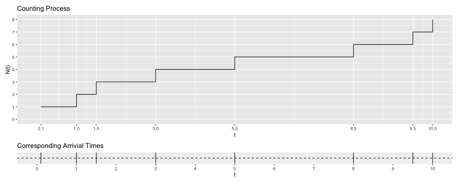

```{r setup, include=FALSE}
knitr::opts_chunk$set(echo = FALSE)
```

```{r warning=FALSE, message=FALSE}
library(spatstat)
library(tidyverse)
library(here)
```

## Background and Objectives

## Introductions, Definitions, Properties, and Applications

1. Counting process
2. HPP (Homogeneous Poisson Process)
3. NPP (Nonhomogeneous Poisson Process)
4. Cox and Cluster processes 
5. Hawkes process 
6. Spatio-temporal SEPP (Self-exciting point process)

## Counting Process

## Counting Process



## HPP (Homogeneous Poisson Process)

## HPP


## NPP (Nonhomogeneous Poisson Process)

## HPP vs. NPP in 2D

{height=50%, width=50%}

## Cox and Cluter Processes

## Cox vs. Matern Cluter in 2D

{height=50%, width=50%}

## (Temporal) Hawkes Process

## Hawkes Process


## Thinning Algorithm

Thinning algorithm is also called acceptance-rejection method. 

## Spatio-temporal SEPP (Self-Exciting Point Process)


## Acknowledgments

I want to thank Dr. James Molyneux for his constant support and encouragement while advising this Master's project, Dr. Lisa Madsen & Dr. Charlotte Wickham for their willingness to co-advise as I press on for the PhD program here at OSU, Dr. Sarah Emerson for both academic and nonacademic support that played major roles in my decision to pursue the PhD here, my cohort for summer comp (comprehensive exam) studies, theories HW and group projects, our previous cohort and other PhD students for reassuring us that we will make it too despite the ongoing challenges, my family and friends for keeping me sane while being remote, and my 92-year-old grandma for hanging in there while battling brain tumor since last year. But no thanks, COVID-19 pandemic, 2020 Oregon wildfires and the social unrest that sparked the Black Lives Matter & Stop Asian Hate movement. 


